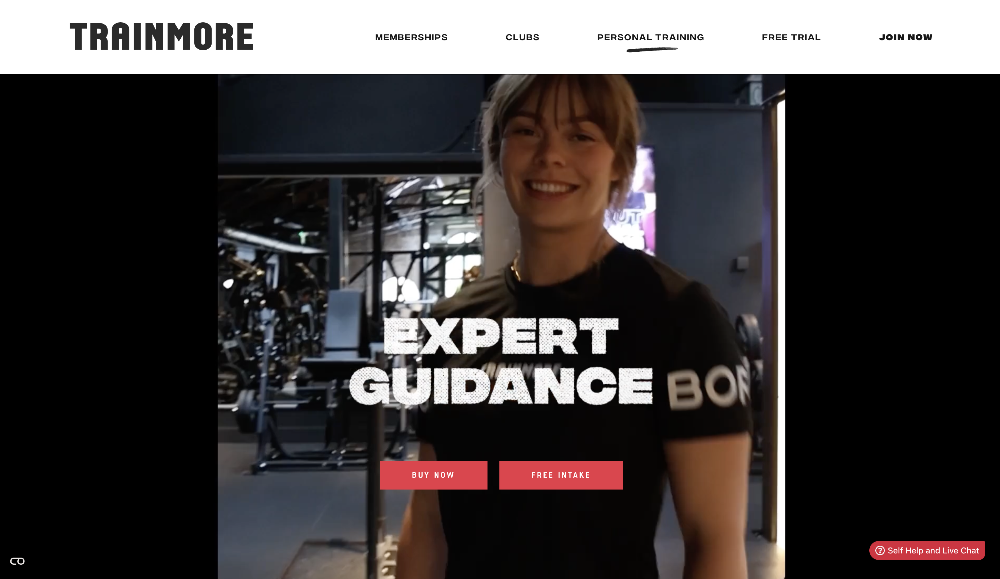
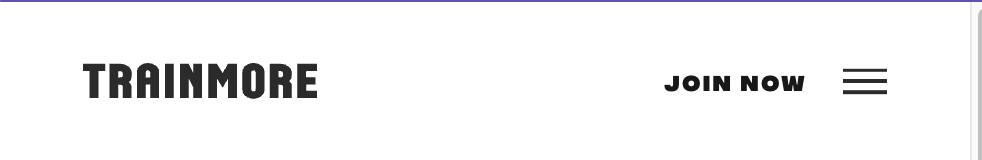
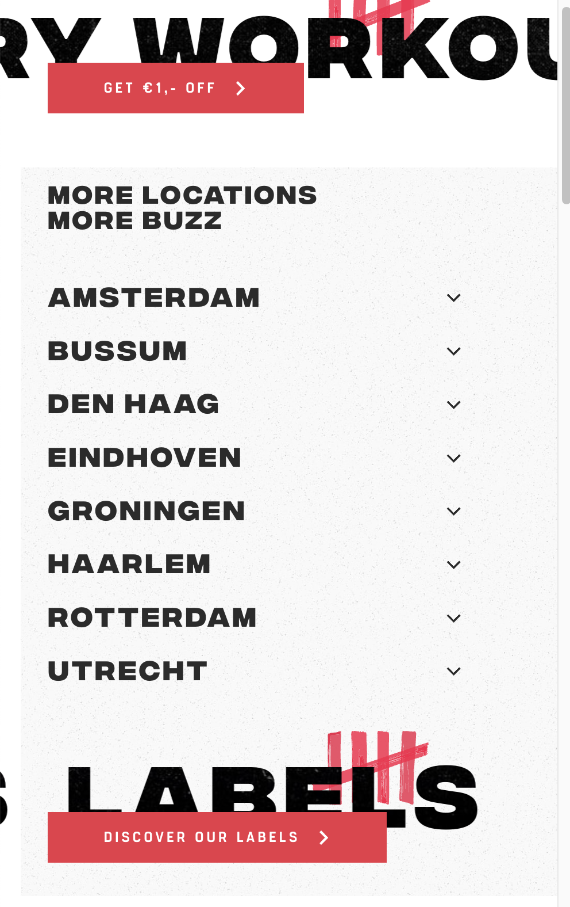

# Procesverslag

Markdown is een simpele manier om HTML te schrijven.  
Markdown cheat cheet: [Hulp bij het schrijven van Markdown](https://github.com/adam-p/markdown-here/wiki/Markdown-Cheatsheet).

Nb. De standaardstructuur en de spartaanse opmaak van de README.md zijn helemaal prima. Het gaat om de inhoud van je procesverslag. Besteedt de tijd voor pracht en praal aan je website.

Nb. Door _open_ toe te voegen aan een _details_ element kun je deze standaard open zetten. Fijn om dat steeds voor de relevante stuk(ken) te doen.

## Jij

  
uitwerken voor kick-off werkgroep

### Auteur:

Loïs Metzelaar

#### Je startniveau:

Blauw

#### Je focus:

Responsiveness

## Je website

  
uitwerken voor kick-off werkgroep

### Je opdracht:

https://trainmore.nl/personal-training/

#### Screenshot(s) van de eerste pagina (small screen):

hier de naam van de pagina  
 

#### Screenshot(s) van de tweede pagina (small screen):

hier de naam van de pagina  
 

## Toegankelijkheidstest 1/2 (week 1)

  
uitwerken na test in 2e werkgroep

### Bevindingen

screenreader werkt redelijk maar niet bij alle onderdelen duidelijk
met shift/tab worden de onderdelen waar je doorheen tabt rood om,ijnd
de kopjes zijn over het algemeen goed verdeeld, maar er wordt erg veel gebruik gemaakt van h2tjes
de website is goed te bedienen op telefoon (knoppen op bepaalde plekken wel dicht bij elkaar)
de images hebben niet overal de juiste alts
De videos op de website worden automatisch afgespeelt deze kun je niet op pauze zetten (homepage)

## Breakdownschets (week 1)

  
uitwerken na afloop 3e werkgroep

### de hele pagina:

  

### dynamisch deel (bijv menu):

  

### wellicht nog een dynamisch deel (bijv filter):

  

## Voortgang 1 (week 2)

  
uitwerken voor 1e voortgang

### Stand van zaken

hier dit ging goed & dit was lastig (neem ook screenshots op van delen van je website en code)

### Agenda voor meeting

samen met je groepje opstellen

| student 1   | student 2          | student 3    | student 4        |
| ----------- | ------------------ | ------------ | ---------------- |
| HTML        | HTML               | HTML         | HTML             |
| bewegende   | dit als er tijd is | nog een punt | dit wil ik zeker |
| achtergrond | ...                | ...          | ...              |

### Verslag van meeting

hier na afloop snel de uitkomsten van de meeting vastleggen

- Html gecheckt op dingen die weg gelaten konden worden. Had perongeluk mijn website nog geen main en header gegeven.
- Hoe je gemakkelijk een toggle menutje maakt voor mijn website goed van toepassing bij de lijst met locaties.
- nog een punt
- .

## Voortgang 2 (week 3)

  
uitwerken voor 2e voortgang

### Stand van zaken

Momenteel gaat ook alles nog goed. Ik ben nog niet erg ver ivm ziek zijn... Ik besrpeek veel met klasgenoten en kijk zo nodig op internet en youtube om later dingen te kunnen toepassen.

### Agenda voor meeting

- vragen over scrollende tekst
- svg's 1 voor 1 laten tekenen op de achtergrond
-

### Verslag van meeting

hier na afloop snel de uitkomsten van de meeting vastleggen

- BIj nienke gezien hoe ik dingen een voor een tevoorschijn kan laten komen. Ik ga het eerst zelf proberen, mocht dit niet lukken ga ik nienke vragen om mij te helpen.
- geleerd hoe ik mijn join now knop moet laten staan naast het hamburger menu wanneer het scherm kleiner word gemaakt.

## Toegankelijkheidstest 2/2 (week 4)

  
uitwerken na test in 9e werkgroep

### Bevindingen
- de screenreader van mijn website is verbeterd deze was op de arginele website heel slecht geen plaatje of link werd uitgelegd ik heb gezzorgd dat mijn website dit wel heeft.

- videos op de website konden niet gepauseerd worden ik heb daarom gekozen voor een stilstaand beeld, ook omdat ik de orginele videos niet kon vinden in de code. 

- Er is nu een darkmode aan toegevoegd aan de website die ik maak!

- de responsiveness moet wel echt nog gedaan worden!

## Voortgang 3 (week 4)

  
uitwerken voor 3e voortgang

### Stand van zaken

Het gaat tot dit punt goed uit vee dingen kom ik zelf. Sommige dingen zoek ik op maar probeer het dan alleen te lezen en zelf toe te passen.

### Agenda voor meeting

samen met je groepje opstellen

- filter over fotos
- scrollende tekst labels
- dark mode
- vraag over een popup die net altijd laten zien wordt

### Verslag van meeting

k had gesprek 3 alleen met sanne deze keer aangezien ik een tijdje ziek ben geweest.

- geleerd hoe ik zelf een filter kan maken voor over een foto
- geleerd hoe ik een filter over mijn foto kan toevoegen
- besproken heo ik mijn website het best kan doen in darkmode
- de popup alleen tevoorschijn laten komen als dit van toepassing is voor die persoon
- 

## Eindgesprek (week 5)

  
uitwerken voor eindgesprek

### Je uitkomst - karakteristiek screenshots:

   
  

### Dit ging goed/Heb ik geleerd:

Korte omschrijving met plaatjes

  

### Dit was lastig/Is niet gelukt:

Korte omschrijving met plaatjes

  

## Bronnenlijst

  
continu bijhouden terwijl je werkt

Nb. Wees specifiek ('css-tricks' als bron is bijv. niet specifiek genoeg).
Nb. ChatGpT en andere AI horen er ook bij.
Nb. Vermeld de bronnen ook in je code.

1. https://css-tricks.com/a-complete-guide-to-dark-mode-on-the-web/
   https://opensource.com/article/21/10/dark-themes-websites
   (darkmode)

2. https://www.sitepoint.com/style-html-details-element/
   https://chatgpt.com/
   Uitleg sanne tijdens feedback moment 1
   (summary styling)

3. https://developer.mozilla.org/en-US/docs/Web/HTML/Element/details
   Uitleg sanne tijdens feedback moment 1
   (summary Html)

4. /_ https://stackoverflow.com/questions/17212094/fill-background-color-left-to-right-css? newreg=2fbd0bc86bcd495493c6034bee03b702 _/
   uitleg sanne tijdens feedbackgesprek 3
   (a/button transition)

5. https://developer.mozilla.org/en-US/docs/Web/CSS/CSS_animations/Using_CSS_animations
   uitleg in feedbackgesprek was met een marque dit wilde ik vermijden dus heb ik het op deze maneir opgelost  
   (scrolling banner 1 & 2)

6. https://developer.mozilla.org/en-US/docs/Web/API/Element/scrollIntoView
   https://www.w3schools.com/jsref/met_element_scrollintoview.asp
   https://www.javascripttutorial.net/javascript-dom/javascript-scrollintoview/
   (scroll into view fotos) 3 secties
7. https://css-tricks.com/snippets/css/complete-guide-grid/
   (uitleg volledig over grid komt ook deels uit de lessen)

8. https://css-tricks.com/a-complete-guide-to-dark-mode-on-the-web/
   (dark mode)

9. /_ kan de link van de codepen van sanne niet mer vinden
   Maar doormiddel van uitleg van Sanne in de les _/
   (hamburgermenu naar kruisje en terug)

10. https://icons8.com/ 
    (iconen in footer)

